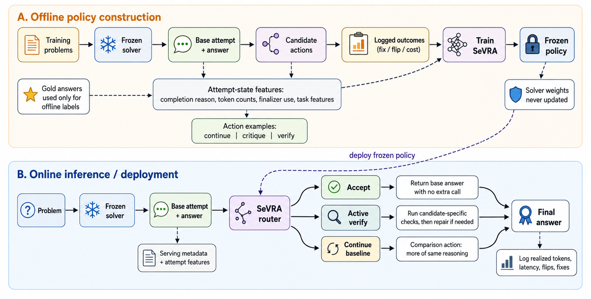

# SEVRA

[](https://github.com/Sajib-006/SEVRA/actions/workflows/tests.yml)
[](https://www.python.org/)
[](LICENSE)
[](https://huggingface.co/spaces/sevra-space/sevra-replay)

**Selective Verification for Reasoning Allocation**

SEVRA is a lightweight serving-layer controller that decides whether to accept a model's
first answer or spend one additional call on candidate-specific verification. It is designed
for systems where extra reasoning can fix failures, waste compute, or turn a correct answer
into an incorrect one.

The core library is model- and provider-agnostic. Bring any recoverability scorer and any LLM
client; SEVRA handles the decision, active-verification prompt, and policy accounting.

> Associated manuscript: [**Think Again or Think Longer? Selective Verification for
> Budget-Aware Reasoning**](https://arxiv.org/abs/2606.19808) (2026).

## Why SEVRA?

Most inference-scaling systems ask how much compute a problem deserves. SEVRA asks a more
specific question after seeing the first attempt:

> **Is this particular attempt likely to be repaired by active verification?**

This distinction matters. A hard problem may already be solved correctly, while an easy problem
may have a truncated attempt. Blindly verifying both adds cost and can introduce harmful flips.

## How it works

<p align="center">
  
</p>

**Offline policy construction.** A frozen solver produces base attempts for training problems.
Candidate recovery actions are executed, and their helpful fixes, harmful flips, and realized costs
are logged. Gold answers are used only to create these offline labels. SEVRA then learns a
recoverability policy from the problem, attempted solution, completion state, token counts,
finalizer use, and task features; the solver weights remain unchanged.

**Online inference.** The frozen solver first produces one base attempt. The deployed SEVRA router
sees only that attempt and serving-visible metadata, never the gold answer. It either accepts the
answer with no extra call or invokes active verification to run candidate-specific checks and repair
the answer when necessary. The continuation branch shown in the figure is an experimental
comparison baseline, not an additional requirement for using SEVRA.

In production, log the selected action, realized tokens, latency, answer changes, helpful fixes, and
harmful flips. These measurements make threshold calibration and workload-shift monitoring
possible without changing the underlying solver.

## Pretrained artifacts

| Artifact | Description |
|---|---|
| [SEVRA Qwen3-0.6B gate](https://huggingface.co/Sajib-006/sevra-qwen3-0.6b-gate) | Smaller QLoRA recoverability classifier |
| [SEVRA Qwen3-1.7B gate](https://huggingface.co/Sajib-006/sevra-qwen3-1.7b-gate) | Primary gate used for the strongest reported selective policy |
| [SEVRA Recovery Outcomes](https://huggingface.co/datasets/Sajib-006/sevra-recovery-outcomes) | 17,120 action-outcome rows across train, MATH500, GSM8K, and CommonsenseQA |

Load the complete intervention-outcome dataset directly from the Hub:

```python
from datasets import load_dataset

outcomes = load_dataset("Sajib-006/sevra-recovery-outcomes")
```

The pretrained gate plugs into the same provider-agnostic controller:

```python
from sevra import HuggingFaceGate, SEVRAController

gate = HuggingFaceGate.from_pretrained("Sajib-006/sevra-qwen3-1.7b-gate")
controller = SEVRAController(gate=gate, threshold=gate.threshold)
```

Install the optional model dependencies with `pip install -e ".[train]"`. The adapter loader
automatically retrieves the matching Qwen3 sequence-classification base and the frozen development
threshold. Use `load_in_4bit=True` on a compatible CUDA system to reduce memory use.

## Main findings

The final study uses a frozen Qwen3-4B solver. Gates are trained on MATH recovery outcomes and
transferred to evaluation workloads without changing the solver.

| Workload | Policy | Accuracy | Extra-call rate | Realized total tokens | Harmful flips |
|---|---|---:|---:|---:|---:|
| MATH500 | Base, 4,096-token limit | 59.0 | 0.0% | 4,313 | 0.0% |
| MATH500 | Always active verify | 75.5 | 100.0% | 8,125 | 2.2% |
| MATH500 | **SEVRA** | **76.3** | **48.2%** | **7,104** | **1.0%** |
| MATH500 | Long base, 8,192-token limit | 76.0 | 0.0% | 5,124 | 0.0% |
| GSM8K | Base, 4,096-token limit | 93.40 | 0.0% | 1,180 | 0.00% |
| GSM8K | Always active verify | 93.40 | 100.0% | 2,932 | 1.25% |
| GSM8K | **SEVRA, frozen transfer** | **94.47** | **3.0%** | **1,335** | **0.00%** |
| GSM8K | Long base, 8,192-token limit | 94.54 | 0.0% | 1,157 | 0.00% |

The conclusion is intentionally nuanced: selective verification is the strongest tested
post-generation recovery policy, but it is not automatically the best compute allocation. Tune
the initial reasoning budget first. Use selective recovery when explicit checks, bounded retries,
auditability, or regression-risk control matter.

CommonsenseQA further shows that intervention choice is workload-dependent: always-on active
verification decreases accuracy from 76.49 to 72.32, while Self-Consistency@5 reaches 78.38 at
roughly five times the realized token cost of the base policy.

## Installation

Core routing has no third-party runtime dependencies:

```bash
git clone https://github.com/Sajib-006/SEVRA.git
cd SEVRA
python -m venv .venv
source .venv/bin/activate
pip install -e .
```

For QLoRA gate training and evaluation, first install the CUDA-enabled PyTorch build appropriate
for your system, then install the training extra:

```bash
pip install -e ".[train]"
```

## 30-second example

```python
from sevra import Attempt, CallableGate, SEVRAController, VerificationOutput

gate = CallableGate(lambda attempt: my_recoverability_model(attempt))
controller = SEVRAController(gate=gate, threshold=0.60)

attempt = Attempt(
    query=user_query,
    base_response=base_response,
    task_type="math",
    difficulty=0.72,
    verification_need=0.80,
    base_actual_tokens=4096,
    base_done_reason="length",
)

def verify(prompt: str, attempt: Attempt) -> VerificationOutput:
    response, usage = my_llm_client.generate(prompt)
    return VerificationOutput(response=response, actual_tokens=usage.total_tokens)

result = controller.run(attempt, verify)
print(result.decision.action)       # accept or active_verify
print(result.final_response)
```

The complete offline example runs without an API key:

```bash
python examples/quickstart.py
```

## Gate options

SEVRA accepts any object with `score(attempt) -> float`.

### Application scorer

Wrap an existing confidence, uncertainty, or classifier endpoint:

```python
from sevra import CallableGate

gate = CallableGate(lambda attempt: client.predict_recoverability(attempt))
```

### Cheap linear gate

`LinearGate` uses only serving-visible features: task difficulty, verification need, constraint
density, ambiguity, retrieval need, finalizer use, length termination, and realized base tokens.

```python
from sevra import LinearGate

gate = LinearGate.from_json("gate.json")
```

The JSON format is intentionally portable:

```json
{
  "intercept": -1.4,
  "weights": {
    "base_done_reason_length": 2.1,
    "verification_need": 0.8,
    "difficulty": 0.5
  }
}
```

### QLoRA sequence classifier

The training utility reproduces the learned gate formulation from the study. It predicts a
`helpful_fix` label from the problem, base attempt, and observable metadata. Gold answers are used
only to construct offline labels; they are never passed to the deployed gate.

```bash
python scripts/train_gate.py \
  --input data/recovery_train.jsonl \
  --model Qwen/Qwen3-0.6B \
  --output-dir outputs/gates/qwen3-0.6b

python scripts/evaluate_gate.py \
  --input data/recovery_test.jsonl \
  --model-dir Sajib-006/sevra-qwen3-0.6b-gate \
  --output outputs/evaluation.json
```

Training defaults to 4-bit QLoRA. Pass `--no-4bit` when quantization is unavailable.

## Recovery-data format

Gate training expects one JSON object per intervention rollout. The important fields are:

```json
{
  "example_id": "42",
  "task_type": "math",
  "query": "...",
  "base_response": "...",
  "action": "active_verify",
  "base_correct": false,
  "final_correct": true,
  "helpful_fix": true,
  "harmful_flip": false,
  "action_actual_tokens": 1830,
  "base_actual_tokens": 4096,
  "base_finalizer_used": true,
  "base_usage": {"done_reason": "length"},
  "features": {
    "difficulty": 0.72,
    "verification_need": 0.80,
    "constraint_density": 0.45,
    "ambiguity_score": 0.10,
    "retrieval_need": 0.00
  }
}
```

Split by `example_id`, not rollout, to prevent the same base attempt from appearing in both train
and development sets. Freeze the gate checkpoint and operating threshold before test evaluation.

## Evaluate a policy without model inference

The replay CLI computes accuracy, intervention rate, helpful fixes, harmful flips, and average
verification tokens from paired outcomes:

```bash
sevra-replay --input examples/replay.jsonl --threshold 0.60
sevra-replay --input examples/replay.jsonl --calibrate
```

Each row needs `base_correct`, `verified_correct`, `gate_score`, and `verification_tokens`. Use
`--calibrate` only on a development split; report test results with the frozen `--threshold`.

## Recommended integration pattern

1. **Tune the base budget.** Measure realized tokens, not only configured limits.
2. **Log paired outcomes offline.** Run active verification on a representative sample.
3. **Label both directions.** Track helpful fixes and harmful flips separately.
4. **Train or fit a gate.** Start with cheap runtime features before adding another model.
5. **Calibrate once.** Select the threshold on development data under your cost objective.
6. **Freeze and monitor.** Log intervention rate, answer changes, token cost, and latency by workload.

SEVRA does not prescribe an LLM provider, answer parser, or correctness evaluator. Those choices are
application-specific and should remain in the host system.

## Repository layout

```text
src/sevra/          Core controller, prompts, gates, and metrics
scripts/            Optional QLoRA gate training and evaluation
examples/           Offline integration and policy-replay examples
tests/              Unit tests for routing and accounting
.github/workflows/  Continuous integration
```

## Reproducibility notes

- The reported solver is frozen Qwen3-4B; the controller does not update solver weights.
- The base generation limit is 4,096 tokens; active verification receives up to 4,096 additional
  tokens when selected.
- The learned 0.6B and 1.7B gates use 4-bit QLoRA sequence classification.
- Thresholds are selected on held-out MATH development examples and frozen for MATH500 and GSM8K.
- Total model tokens include prompt and generated tokens for base, verification, and finalizer calls.
- Gate inference cost should be measured separately for production deployment.

The public [replay dashboard](https://huggingface.co/spaces/sevra-space/sevra-replay) provides an
interactive view of the policy trade-offs.

## Development

```bash
pip install -e ".[dev]"
ruff check src tests examples
python -m unittest discover -s tests -v
```

See [CONTRIBUTING.md](CONTRIBUTING.md) for contribution guidelines.

## Citation

If SEVRA is useful in your research or system, please cite the repository and manuscript:

```bibtex
@misc{dip2026sevra,
  title        = {Think Again or Think Longer? Selective Verification for Budget-Aware Reasoning},
  author       = {Sajib Acharjee Dip and Dawei Zhou and Liqing Zhang},
  year         = {2026},
  eprint       = {2606.19808},
  archivePrefix = {arXiv},
  primaryClass = {cs.CL},
  url          = {https://arxiv.org/abs/2606.19808}
}
```

## License

SEVRA is released under the [MIT License](LICENSE).
